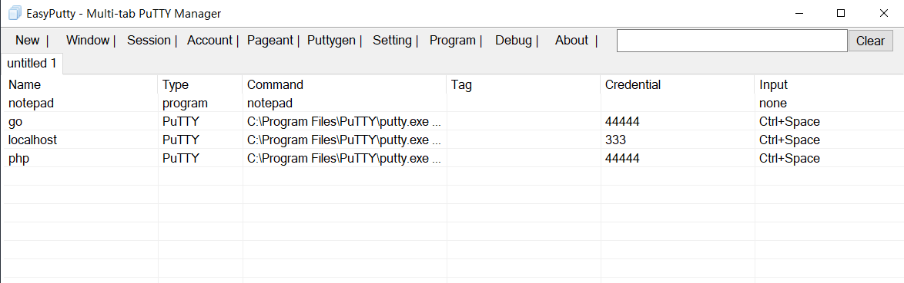
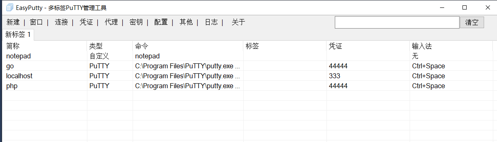
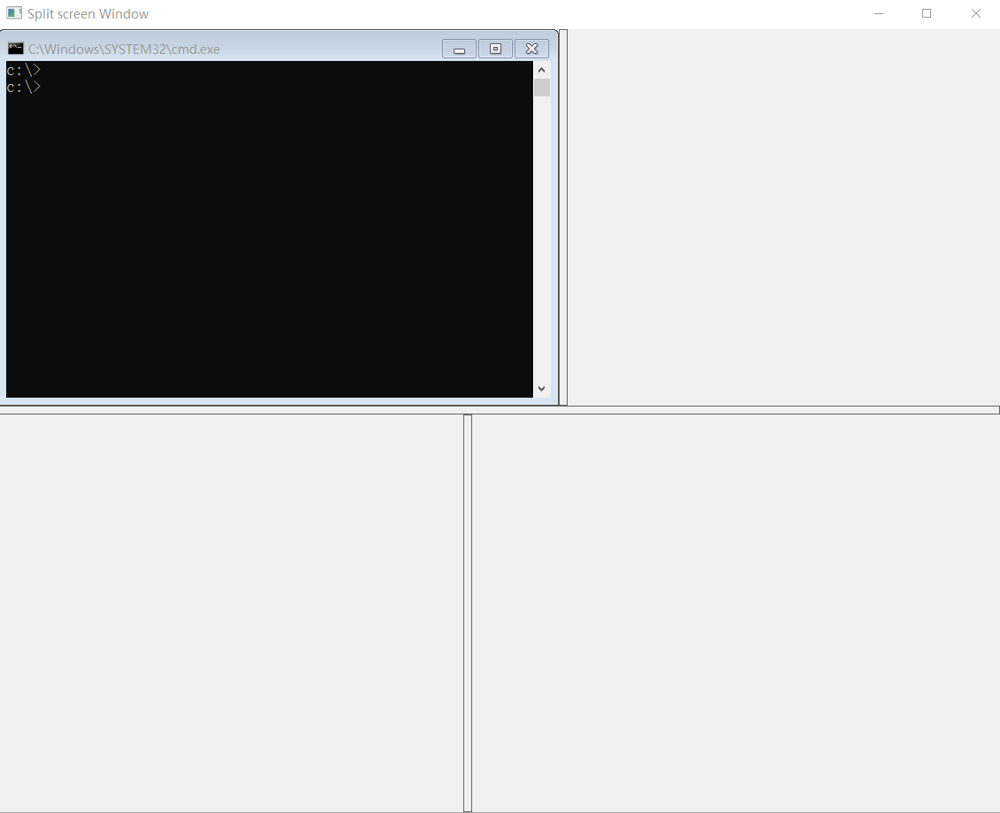

# EasyPutty
易用 多标签 支持 putty

1. 启动puttygen.exe生成ppk证书
2. 启动pageant.exe代理鉴权
3. 标签化putty窗口，支持非putty窗口嵌入，支持分屏
4. 配置文件管理灵活，容易维护
5. 内存占用少，可执行文件小，库依赖少
6. 使用Microsoft Visual Studio 2017编译

# 展示







# 对比方案

## Cmder + PuTTY
- 优点：内存占用少
- 缺点：机器ip多了不好配置

## SuperPuTTY
- 优点：机器ip管理比较方便，但没有Solar-PuTTY配置证书优。
- 缺点：操作有点卡，任务栏唤醒有时要点好几次，最小化最大化会白屏闪一下。
        打开多个标签，有putty窗口被TMOUT关闭时选中标签会变成前一个，如果被关闭的不是当前选中，则选中状态会跳。

## Solar-PuTTY
- 优点：机器ip管理方便，证书配置方便
- 缺点：内存占用多，有广告，GPU占用大会导致整个机器卡


# PuTTYgen 转换 id_rsa 为 ppk 格式
以下是通过 PuTTYgen 图形工具，将 OpenSSH 格式的 `id_rsa` 私钥转换为 PuTTY 专用 `ppk` 格式的操作流程：

### 1. 打开 PuTTYgen 工具
1. 在 PuTTYgen 界面顶部，点击 「Conversions」菜单下的**Import key** 按钮。
2. 弹出文件选择窗口后， 选中 `id_rsa` 文件，点击「打开」。

### 2. 验证密钥并生成 ppk 文件
1. **密码验证（若有）**：  
   - 若生成 `id_rsa` 时设置过密码，会弹出「Enter passphrase to load key」对话框，输入正确密码后点击「OK」。  
   - 若未设置密码，将直接加载成功（界面会显示密钥的指纹信息，如「RSA-2048」「Fingerprint」等）。
2. **保存 ppk 私钥**：  
   - 加载成功后，点击界面右侧 **Save private key** 按钮（位于「Actions」栏目下）。
3. **确认保存（无密码密钥警告）**：  
   - 若 `id_rsa` 无密码，会弹出警告框「Are you sure you want to save this key without a passphrase?」，点击 **Yes** 继续。  
   - 若 `id_rsa` 有密码，无此警告，直接进入保存路径选择界面。
4. **设置保存信息**：  
   - 点击「保存」，完成格式转换。

# 系统没有 VCRUNTIME140.DLL 怎么办

当系统提示缺少 `VCRUNTIME140.DLL` 时，通常是因为缺少 Microsoft Visual C++ 2015-2022 运行库。

分析原因可能是本程序是32位打包，操作系统是64位的，可以按照以下步骤解决：

### **安装微软官方 Visual C++ 运行库**
1. 若缺少62位运行库，下载 [vc_redist.x64.exe](https://aka.ms/vs/17/release/vc_redist.x64.exe) ，
   若缺少32位运行库，下载 [vc_redist.x86.exe](https://aka.ms/vs/17/release/vc_redist.x86.exe)
2. 下载后双击安装程序，按照提示完成安装。（建议上面安装一个不行，另一个也安装试试）
3. 安装完成后重启电脑，检查问题是否解决。

# 开发备忘

## 标签样式
开始编程时tabcontrol标签头显示旧系统样式，为显示新版本系统样式，修改`EasyPuTTY.vcxproj`在`<Link>`节点下增加下面配置实现
```
      <AdditionalManifestDependencies>type='win32' name='Microsoft.Windows.Common-Controls' version='6.0.0.0' processorArchitecture='*' publicKeyToken='6595b64144ccf1df' language='*'</AdditionalManifestDependencies>
      <AdditionalDependencies>comctl32.lib;comdlg32.lib;shlwapi.lib;%(AdditionalDependencies)</AdditionalDependencies>
      <AdditionalLibraryDirectories>$(WindowsSdkDir)Lib\$(Platform)\um;%(AdditionalLibraryDirectories)</AdditionalLibraryDirectories>
```

## 第三方下载
- [putty] http://www.chiark.greenend.org.uk/~sgtatham/putty/download.html
- [winscp] https://winscp.net/download/WinSCP-6.5.2-Portable.zip/download
- [filezilla] https://filezilla-project.org/download.php
